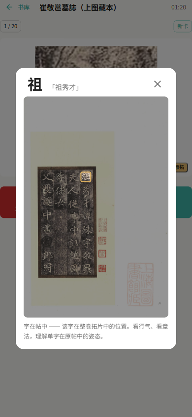

<div align="center">


# 背字帖 Beizitie

**书法碑帖单字记忆 · SM-2 间隔重复 · 开源 · 隐私优先**

[](CHANGELOG.md)
[](LICENSE)
[](https://beizitie.com)
[](https://zaxchou.github.io/beizitie/beizitie.html)

*把背帖这件事，放回每个练字人的口袋里。*

</div>

---

**背字帖**把历代碑帖拆成一张张单字高清卡，用 SM-2 间隔重复算法帮你高效背记字形。市场共上架 **1431 部经核验碑帖、38 万余张单字**（行 803 / 楷 265 / 草 270 / 隶 64 / 篆 31），覆盖楷行草隶篆、184 位书家，其中含上海图书馆藏本 45 部（带整卷原拓坐标）。

所有上架碑帖均经**字图一致性核验**——宁缺勿错，字与图对不上的帖一律不上架；核验通过的帖同时构成集字的取字范围（1476 部 / 41.7 万单字，含未上架的画作长卷）。

## ✨ 功能特性

| 功能 | 说明 |
|---|---|
| 📖 **碑帖市场** | 1431 部碑帖一键订阅，按书体 / 朝代 / 书家筛选；目录离线内联，断网也能逛 |
| 🔁 **SM-2 间隔重复** | 经典算法排复习计划：1 分钟 → 3 分钟 → 10 分钟三轮短间隔，毕业进入 4 天起步的长间隔；出卡顺序支持 到期优先 / 按帖序 / 随机 |
| 🖼 **字在帖中** | 翻卡后可点「原拓」回看该字在整卷拓片中的位置——看行气、看章法，理解单字在原帖中的姿态（上海图书馆藏本帖可用） |
| 🧩 **集字** | 输入任意诗文，从 1476 部已核验碑帖自动匹配原字，拼成书法作品，导出高清 PNG |
| 📶 **离线可学** | 单字图自动本地缓存，断网可复习 |
| 🔒 **隐私优先** | 单文件版学习记录永不出设备；在线版数据可随时导出 |
| 🌗 **多端适配** | PC 双栏布局，移动端底部导航，深色模式 |

## 📸 界面速览

| 碑帖市场 | 学习卡（翻转后） | 字在帖中 |
| :---: | :---: | :---: |
| [](docs/screenshots/market.png) | [](docs/screenshots/study.png) | [](docs/screenshots/zhangfa.png) |
| 按书体 / 朝代筛选，编辑精选 | 真拓单字 + SM-2 评分 | 单字回看整卷位置与行气 |

## 🚀 快速开始

| 方式 | 适合谁 | 入口 |
|---|---|---|
| 🌐 **在线版** | 打开就用，注册即学，数据云端保存 | **[beizitie.com](https://beizitie.com)** ✅ 运营中 |
| 📄 **单文件版** | 无账号，学习记录只存本机 | **[在线试用](https://zaxchou.github.io/beizitie/beizitie.html)** · [下载最新版 beizitie.html](https://github.com/zaxchou/beizitie/releases/latest/download/beizitie.html)（约 1.2MB，双击即用；版本见应用「设置 → 关于」） |
| 🛠 **自托管平台版** | 学校 / 书院 / 团队自建，多用户管理 | 见下文 |

> 单文件版下载后双击打开即可（Chrome / Edge / Safari）。市场目录已内联，订阅和学习时需联网拉取字帖图片。
> 单文件版与在线版的进度格式互通：任意一端「导出 JSON」，另一端「导入」即可迁移；两版各自独立存储，不会自动同步。

### 单文件开源版细节

- 浏览器直接打开，数据保存在本机 IndexedDB，无账号、无服务器、无追踪
- 字库目录（`catalog/`）与单字图由静态 JSON + CDN 直链提供，应用自动保持最新
- 一键导出 / 导入 JSON：备份、换机、分享进度
- 当前能力：市场浏览 → 订阅 → SM-2 学习 → 字在帖中 → 集字 → 学习统计（近 14 天 / 到期预测 / 按帖进度）→ 深色模式 → 字图离线缓存 → 导出 / 导入备份

---

## 🛠 自托管平台版

多用户在线平台：JWT 账号体系、管理员内容后台、市场运营、数据统计。第一个注册的账号自动成为管理员。

### 技术栈

| 层 | 技术 |
|---|------|
| 前端 | React 18 + TypeScript + MUI v5 + Zustand + Vite |
| 后端 | Express 5 + TypeScript (tsx) |
| 数据库 | PostgreSQL（连接参数见环境变量） |
| 算法 | SM-2 纯函数实现（前后端共享同一份代码） |
| 进程 | PM2 + Nginx 反代 |

### 快速开始

```bash
git clone https://github.com/zaxchou/beizitie.git
cd beizitie
npm install
mkdir -p uploads

# 启动后端（默认端口 3001；数据库连接见环境变量）
npx tsx server/index.ts

# 新终端，启动前端（端口 3000）
npx vite --port 3000
```

打开 `http://localhost:3000`，第一个注册的账号自动成为管理员。

### 环境变量（生产必须覆盖）

| 变量 | 默认值 | 说明 |
|------|--------|------|
| `PORT` | `3001` | 后端端口 |
| `JWT_SECRET` | 开发默认值 | 生产**必须设置**，否则拒绝启动 |
| `PG_HOST` / `PG_PORT` / `PG_DATABASE` / `PG_USER` / `PG_PASSWORD` | localhost / 5432 / zi2anki / zi2anki / — | PostgreSQL 连接 |

### 项目结构

```
├── src/            # React 前端（web 13 页 / single 6 页）
│   ├── core/       # 纯逻辑（SM-2、类型）—— 两版本共享
│   ├── data/       # 数据层（服务器 / 本地双实现，同一接口）
│   ├── components/ # 共享组件（FlashCard、原帖视图、评分按钮…）
│   └── platforms/  # web / single 双入口装配
├── server/         # Express 后端（10 个路由模块 + 目录/导入工具脚本）
├── catalog/        # 单文件版静态目录（GitHub Pages 分发）
├── docs/           # 封面设计稿、界面截图、维护 SOP、计划文档
└── beizitie.html   # 单文件版成品（构建产物，随 main 分发）
```

### API 概览（节选）

| 方法 | 路径 | 说明 |
|------|------|------|
| GET | `/api/marketplace/decks` | 市场（支持分页/书体/书家/关键词） |
| GET | `/api/decks/:id/due-cards` | 到期复习队列 |
| POST | `/api/auth/login` | 登录（JWT） |
| GET | `/api/jizi/match` | 集字匹配 |
| GET | `/api/export/:deckId` | 导出 Anki apkg |

---

## ❓ 常见问题

**学习数据存在哪里？会丢吗？**
单文件版存在你浏览器的 IndexedDB 里，不上传任何服务器。定期在「设置 → 导出」备份 JSON 即可万无一失；换电脑用「导入」恢复。

**为什么有些碑帖搜不到？**
我们只上架经字图一致性核验的帖（宁缺勿错）。存量「以观书法」帖正在逐批核验，通过后会陆续回库。

**集字的字找不全怎么办？**
集字只在已核验碑帖内取字，生僻字可能缺字——这是刻意的取舍：宁可缺字，不用可疑的字图。

## 🤝 参与贡献

Issue / PR 都欢迎。`HANDOFF.md` 里有完整的架构说明与踩坑记录，改代码前建议先读；涉及市场 / 学习等两版共用功能时，请同步检查 web 与 single 两个入口（见 `docs/双版本维护SOP.md`）。

## 🙏 致谢与数据来源

- **[上海图书馆碑帖知识库《翰墨瑰宝》](https://iiif.library.sh.cn)** — 45 部馆藏碑帖的整卷原拓与单字坐标（CC BY-NC-ND 3.0 CN），「字在帖中」功能的数据来源
- **以观书法（YGSF）** — 碑帖单字图数据
- **[zupu](https://github.com/zaxchou/zupu)** — 单文件开源族谱工具，本仓库单文件版的架构灵感来源
- **[molin.wiki](https://molin.wiki)** — 中国书画 AI 分析与知识平台（姊妹项目）

## 📄 License

[MIT](LICENSE) © zaxchou

碑帖图片数据遵循来源方各自的许可：上海图书馆部分为 CC BY-NC-ND 3.0 CN（署名-非商业性使用-禁止演绎），仅供个人学习研究，请勿商用。
